# Northwest Cadence Cascading Fields Extension

This extension gives you possibility of handling hierarchical (tree like) structures in a an easy to understand linear set of dropdown controls.

## Settings
When at project level, you'll see "Cascade Field Settings" menu item which will bring you to where you will set the cascade levels, values and their mapping.

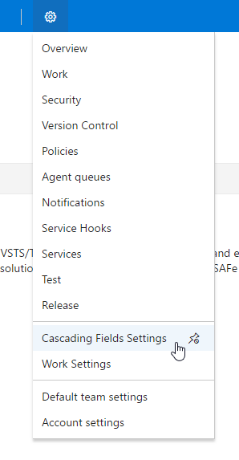

Settings page. Arrows show how levels map to values.   
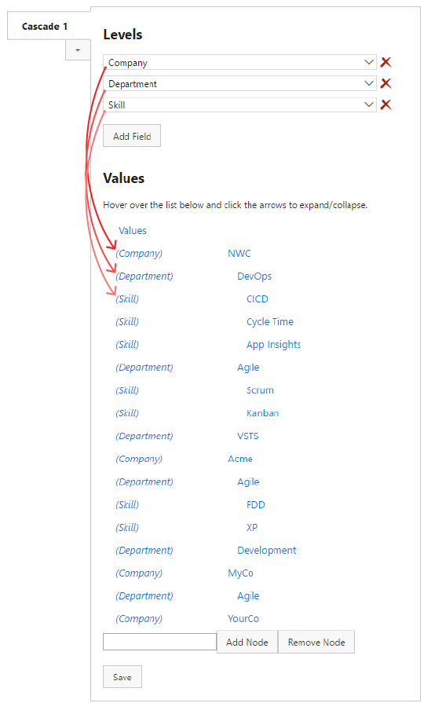

All values from level are the options of a dropdown  

## Setting up controls

add a custom control - icon   
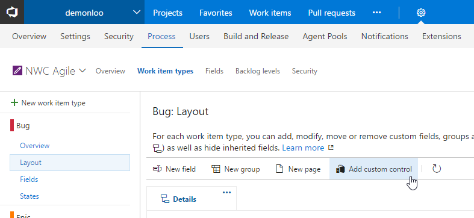

1st control - add a custom control: definition tab   
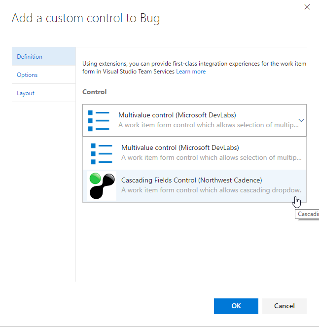

1st control - add a custom control: options tab   
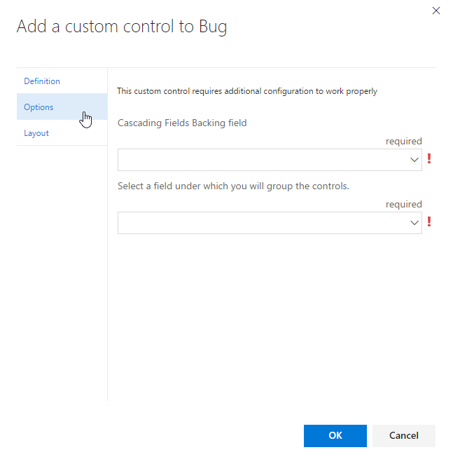

1st control - add a custom control: options tab, fields selected   

1st control - add a custom control: layout tab   
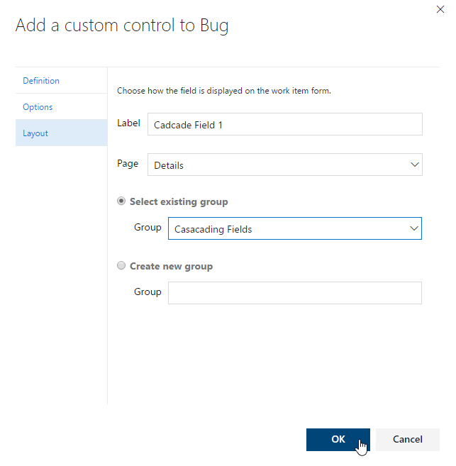

First control added to process   
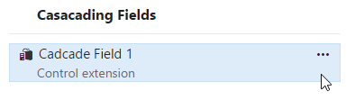

2nd control - add a custom control: options tab   
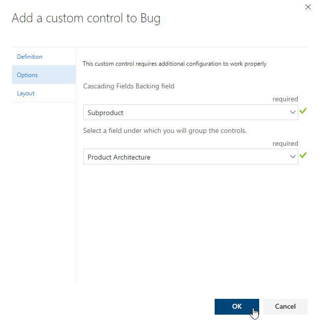

Add a custom control: Layout tab   
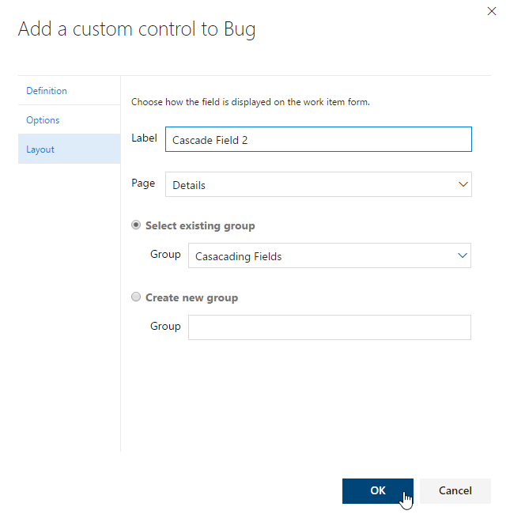

Second control added to process   
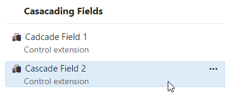

Control as shown on form   
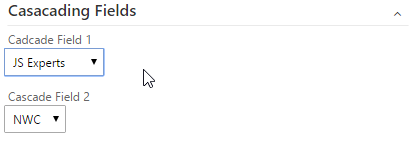

First field is the actual backing field for the control and the second field will be the same for all controls. This practically means you'll have to create one additional field for one cascade.

Brought to you by [Northwest Cadence](http://nwcadence.com).